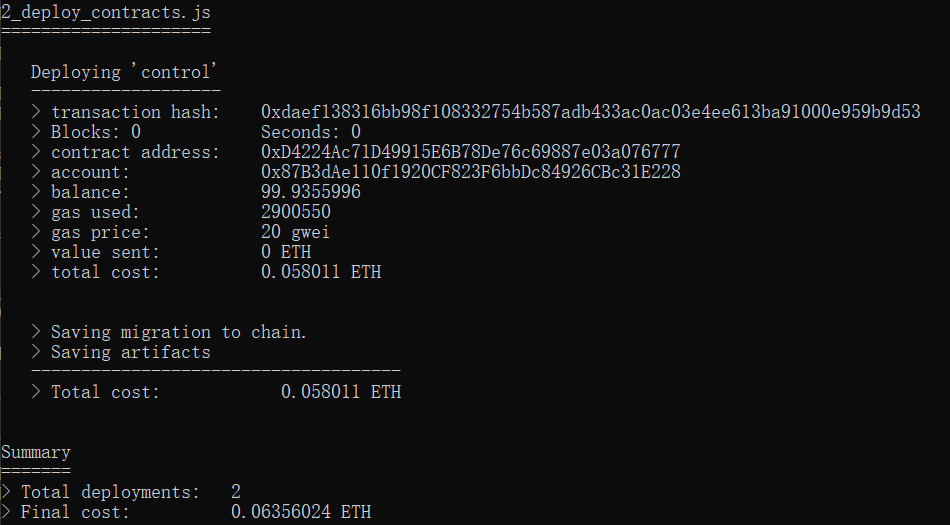
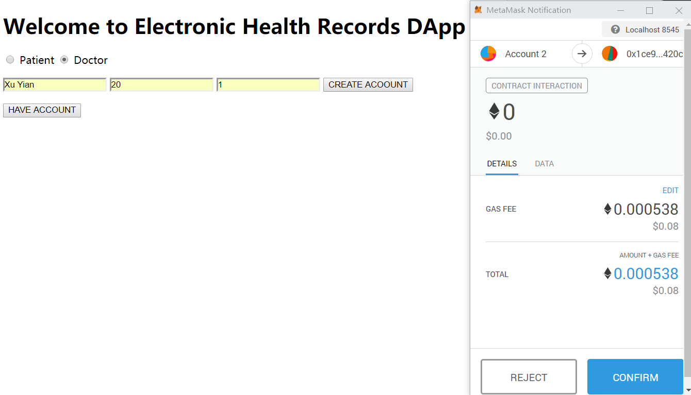

# 区块链期末项目
## Electronic Health Records DApp

---
16340265 许倚安

本项目是一项让病人来管理自己的电子健康记录、仅在看病时将权限开放给医生，不需要每到一个医院就开一个病历档案的DApp。

---

## 一、Github地址

[Github地址](https://github.com/465924212/ehrProject)

## 二、选题背景、依据

[选题背景](./doc/选题背景.pdf)

[选题背景2(上学期的essay)](./doc/ItispeoplenotpoliciestodealwithEHRprivacyproblem.pdf)

## 三、使用方法

  系统：Windows10

  环境：node.js, npm, truffle, ganache-cli, chrome, metamask

### 安装步骤：

  1. 将项目拉取到本地，在项目根目录打开命令行界面，输入以下代码

    ganache-cli -p 8545

  运行结果应当如图
  
  

  复制图中红框处的mnemonic待用。

  2. 在项目根目录再打开一个命令行界面，输入以下代码

    truffle compile
    truffle migrate --development

  运行结果应当如图

  

  

  

  3. 在项目根目录打开第三个命令行界面，输入以下代码

    npm run dev

  运行结果应当如图

  

  此时会自动打开浏览器，使用地址localhost:3000访问该DApp

  

  4. 使用Chrome浏览器，启动MetaMask插件，点击插件中的“Import Using Account Seed Phrase”，在窗口的Wallet Seed中粘贴第一步复制下来的红框内容，并设置自己的密码，如图，点击Restore，最后将插件右上角的连接网络修改为locoalhost 8545，即可开始使用该DApp

  

### 使用步骤：

  1. 确认使用的Account中有足够的eth，选中Patient选项，在网页的输入框中输入个人信息，并点击"CREATE ACCOUNT"，即可创建病人账号.

  2. 同理，在MetaMask中更换账号后，选中Doctor选项，输入个人信息，并点击"CREATE ACCOUNT"，即可创建医生账号.

  3. 当病人看病时，使用病人账号，选中Patient选项并点击"HAVE ACCOUNT"，将医生的地址粘贴进输入框，并点击"APPROVE ACCESS"，医生即获得查看并增加病人的健康记录的权利.

  4. 医生写病历时，使用医生账号，选中Doctor选项并点击"HAVE ACCOUNT"，将病人的地址粘贴进输入框，输入症状与诊断，点击"ADD RECORD"，即可增加病人的病历.

  5. 看病完成时，使用病人账号，选中Patient选项并点击"HAVE ACCOUNT"，将医生的地址粘贴进输入框，并点击"CANCEL ACCESS"，医生即失去查看并增加病人的健康记录的权利.

  6. 第一次看病的过程完成后，下次病人去看病时无需进行第1步，直接进行第3步即可。